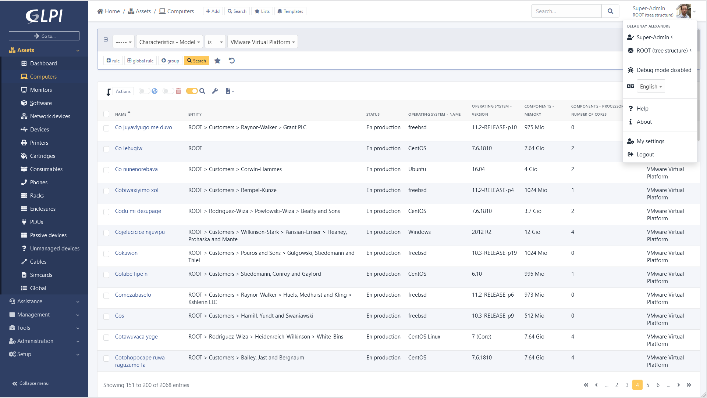

# GLPI pour YunoHost

[](https://dash.yunohost.org/appci/app/glpi)    
[](https://install-app.yunohost.org/?app=glpi)

*[Read this readme in english.](./README.md)*
*[Lire ce readme en français.](./README_fr.md)*

> *Ce package vous permet d'installer GLPI rapidement et simplement sur un serveur YunoHost.
Si vous n'avez pas YunoHost, regardez [ici](https://yunohost.org/#/install) pour savoir comment l'installer et en profiter.*

## Vue d'ensemble

Gestion des services informatiques (ITSM).

**Version incluse :** 9.5.7~ynh1


## Captures d'écran



## Documentations et ressources

* Site officiel de l'app : https://glpi-project.org
* Documentation officielle de l'admin : https://glpi-install.readthedocs.io/en/latest/
* Dépôt de code officiel de l'app : https://github.com/glpi-project/glpi
* Documentation YunoHost pour cette app : https://yunohost.org/app_glpi
* Signaler un bug : https://github.com/YunoHost-Apps/glpi_ynh/issues

## Informations pour les développeurs

Merci de faire vos pull request sur la [branche testing](https://github.com/YunoHost-Apps/glpi_ynh/tree/testing).

Pour essayer la branche testing, procédez comme suit.
```
sudo yunohost app install https://github.com/YunoHost-Apps/glpi_ynh/tree/testing --debug
ou
sudo yunohost app upgrade glpi -u https://github.com/YunoHost-Apps/glpi_ynh/tree/testing --debug
```

**Plus d'infos sur le packaging d'applications :** https://yunohost.org/packaging_apps